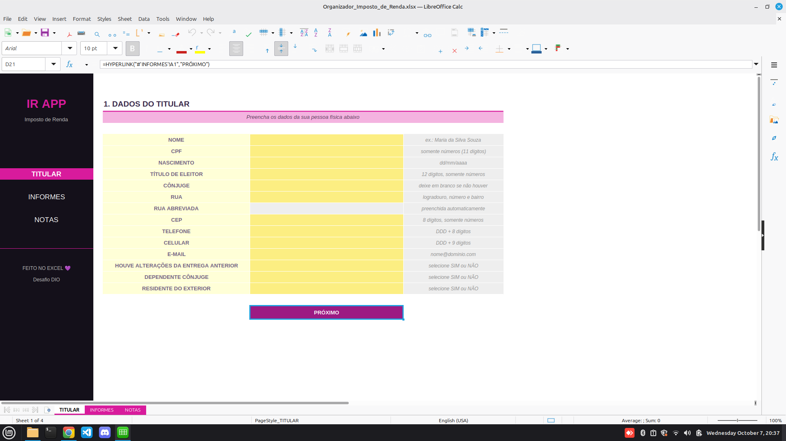
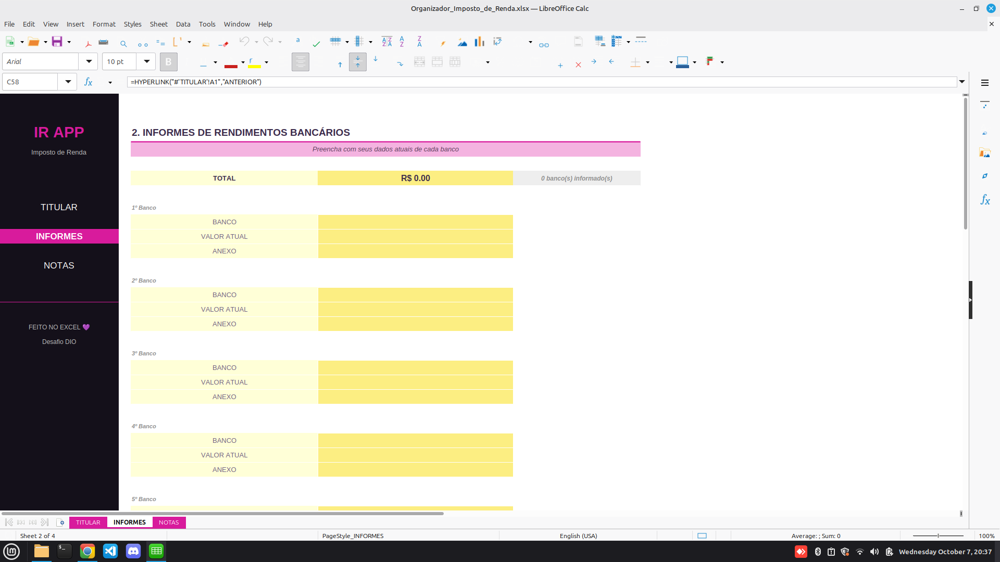
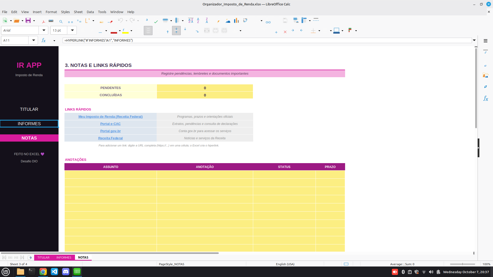

# 📊 IR APP – Organizador de Imposto de Renda em Excel

Agregador de dados para a declaração de Imposto de Renda construído **100% no Excel**. A ferramenta reúne os dados do titular, os informes de rendimentos bancários e as notas/pendências em telas com **menu lateral de navegação**, **validações automáticas**, **formatações personalizadas** e **links rápidos** para os sites da Receita Federal.

> Projeto desenvolvido como desafio da [DIO](https://www.dio.me/) – "Criando um Organizador de Declaração de Imposto de Renda".

---

## 🖼️ Telas

| 1. Titular | 2. Informes |
|---|---|
|  |  |

| 3. Notas |
|---|
|  |

> As imagens foram geradas a partir de uma cópia com **dados fictícios**, apenas para ilustração. O arquivo do projeto está em branco.

## 🗂️ Estrutura do arquivo (`Organizador_Imposto_de_Renda.xlsx`)

| Aba | Conteúdo |
|---|---|
| **TITULAR** | 14 campos: nome, CPF, nascimento, título de eleitor, cônjuge, endereço, endereço abreviado, CEP, telefone, celular, e-mail e 3 perguntas SIM/NÃO. Botão **PRÓXIMO →** para a próxima tela |
| **INFORMES** | Até 10 bancos, com banco, valor atual e anexo (nome do arquivo). **TOTAL** automático e status de preenchimento por banco |
| **NOTAS** | Contadores de pendências, links rápidos (Receita Federal, e-CAC, gov.br) e tabela de anotações com status e prazo |
| **LISTAS** *(oculta)* | Bancos, SIM/NÃO, status das notas e tabela de abreviação de logradouros |

O **menu lateral** (TITULAR · INFORMES · NOTAS) aparece em todas as telas, com a tela atual destacada.

## ⚙️ Recursos de Excel utilizados

**Menu e navegação**
- Menu lateral com a função `HYPERLINK` para saltar entre as abas e botão "PRÓXIMO →".
- Hiperlinks externos para os sites oficiais.
- Interface sem linhas de grade e sem cabeçalhos de linha/coluna, para aparência de aplicativo.

**Formatações personalizadas** (o usuário digita só números; a máscara é aplicada automaticamente)
- CPF: `000\.000\.000\-00` · CEP: `00000\-000`
- Telefone: `\(00\)\ 0000\-0000` · Celular: `\(00\)\ 00000\-0000`
- Título de eleitor: `0000\ 0000\ 0000` · Valores: `"R$ "#,##0.00` · Datas: `dd/mm/yyyy`

**Validação de dados**
- Listas suspensas (SIM/NÃO, bancos, status).
- Números inteiros com faixa de tamanho (CPF, CEP, telefone, celular, título).
- Data de nascimento entre 1900 e hoje.
- Nome completo (exige nome e sobrenome), e-mail válido, texto com limite de caracteres.
- Valores monetários maiores ou iguais a zero.
- Anexo restrito às extensões `.pdf`, `.png`, `.jpg` e `.jpeg`.
- Mensagens de entrada (dicas) e de erro personalizadas.

**Fórmulas**
- **Conferência do CPF**: cálculo dos dígitos verificadores (`SUMPRODUCT`, `MID`, `MOD`), exibindo "✔ CPF válido" ou "⚠ confira os dígitos".
- **Rua abreviada automática**: `INDEX` + `MATCH` na tabela da aba LISTAS (Rua → R., Avenida → Av., etc.).
- **TOTAL dos informes**: `SUMIF` e contagem de bancos com `SUMPRODUCT`.
- **Status por banco**: `IF` indicando "✔ completo" ou "⚠ falta valor ou anexo".
- **Notas**: `COUNTIF` para pendentes e concluídas.

**Formatação condicional**: semáforo ✔/⚠, status coloridos e prazos vencidos em vermelho.

## ▶️ Como usar

1. Abra o arquivo na tela **TITULAR** e preencha as **células amarelas**.
2. Digite CPF, CEP, telefones e título **somente com números**; a máscara aparece sozinha.
3. Clique em **PRÓXIMO →** (ou no menu lateral) para ir aos **INFORMES** e escolher o banco, o valor e o nome do arquivo anexo.
4. Use **NOTAS** para registrar pendências e acessar os links rápidos.

## 📁 Estrutura do repositório

```
├── README.md
├── Organizador_Imposto_de_Renda.xlsx
└── images/
    ├── 01_titular.png
    ├── 02_informes.png
    └── 03_notas.png
```

## ⚠️ Observações

- A ferramenta **organiza** informações e **não substitui** o programa oficial da Receita Federal nem orientação contábil.
- A conferência do CPF verifica apenas os dígitos verificadores.
- Os dados ficam somente no seu computador.
- Recomendado: Excel para Windows/Mac ou Microsoft 365.

## 🧠 Aprendizados

- Construção de uma interface com aparência de aplicativo dentro do Excel.
- Uso de formatações personalizadas, validação de dados e fórmulas para garantir a qualidade das entradas.
- Documentação técnica em Markdown e compartilhamento via GitHub.
