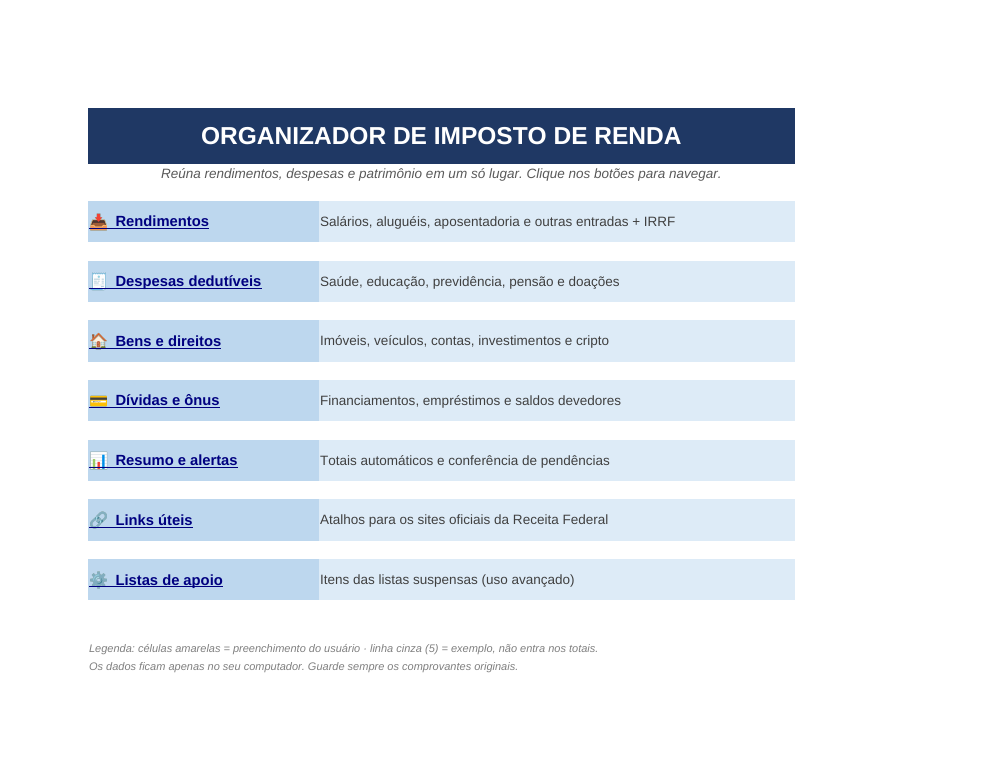
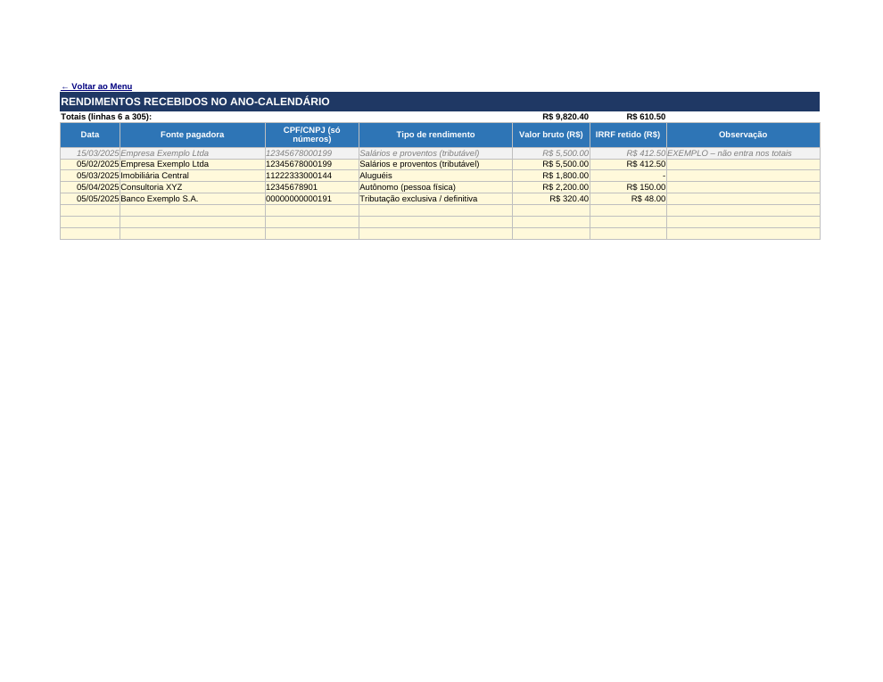
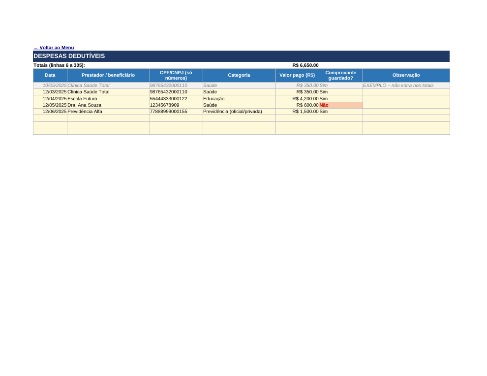
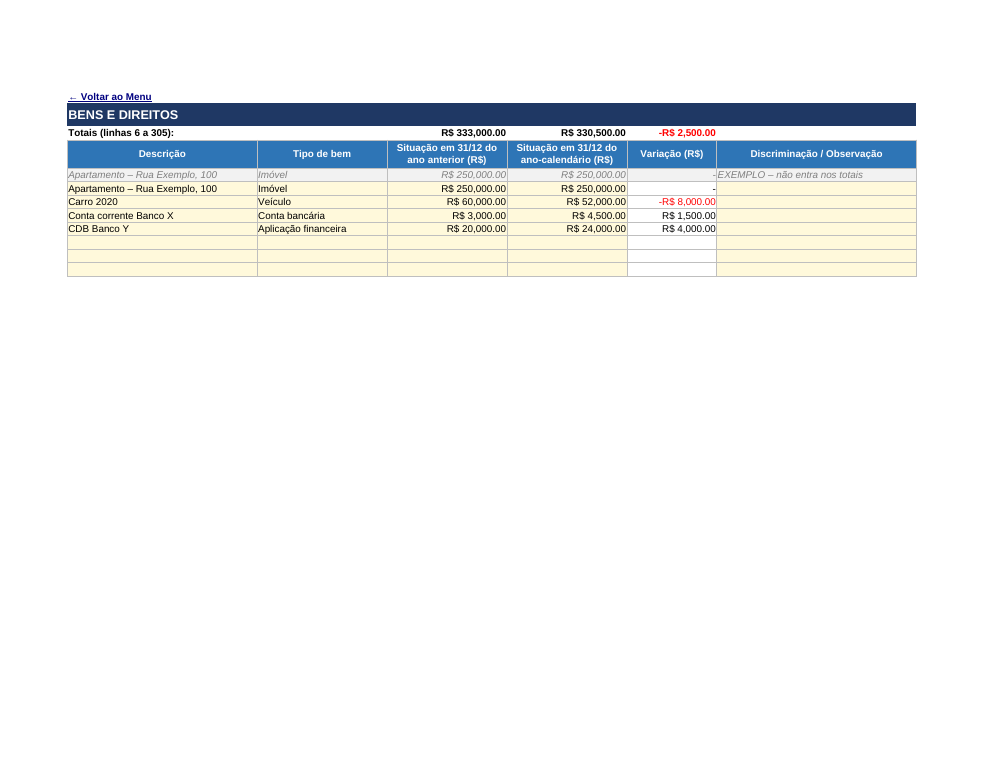
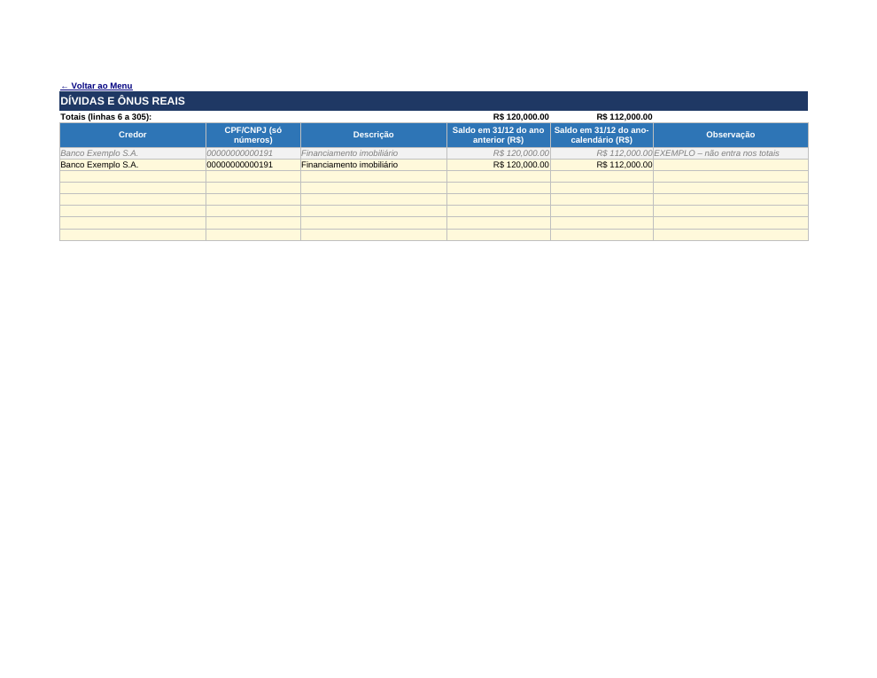
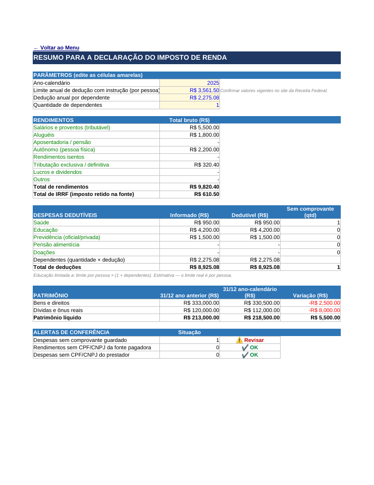

# 📊 Organizador de Imposto de Renda em Excel

Ferramenta construída **100% no Excel** para reunir, em um só lugar, as informações necessárias para a declaração de Imposto de Renda (IRPF): rendimentos, despesas dedutíveis, bens e direitos e dívidas. Possui menu de navegação, validações automáticas de dados, resumo com totais calculados por fórmulas e alertas de conferência.

> Projeto desenvolvido como desafio da [DIO](https://www.dio.me/) – Excel.

---

## 🎯 Objetivos

- Centralizar os dados do ano-calendário em abas organizadas.
- Evitar erros de digitação com **validação de dados**.
- Navegar com facilidade por **menu com hiperlinks internos**.
- Consolidar tudo automaticamente em um **resumo** com alertas de pendências.
- Oferecer **links rápidos** para os sites oficiais da Receita Federal.

## 🗂️ Estrutura do arquivo (`Organizador_Imposto_de_Renda.xlsx`)

| Aba | Função |
|---|---|
| **Menu** | Página inicial com botões (hiperlinks) para todas as abas |
| **Rendimentos** | Data, fonte pagadora, CPF/CNPJ, tipo, valor bruto, IRRF e observação |
| **Despesas** | Despesas dedutíveis por categoria, com controle de comprovante guardado |
| **Bens_Direitos** | Bens com valor em 31/12 do ano anterior e do ano-calendário; variação calculada |
| **Dividas** | Dívidas e ônus reais com saldos nas duas datas |
| **Resumo** | Totais por tipo/categoria, deduções, patrimônio e alertas |
| **Links_Uteis** | Atalhos para sites oficiais (Receita Federal, e-CAC, gov.br) |
| **Listas** | Itens das listas suspensas (tipos de rendimento, categorias, tipos de bem, Sim/Não) |

Cada aba possui o link **← Voltar ao Menu** na célula A1.

## ⚙️ Recursos de Excel utilizados

- **Hiperlinks internos** para navegação entre abas e **hiperlinks externos** para sites.
- **Validação de dados**:
  - Listas suspensas (tipo de rendimento, categoria de despesa, tipo de bem, Sim/Não), alimentadas pela aba `Listas`;
  - Datas restritas ao ano-calendário (via **nome definido** `AnoCalendario`);
  - Valores numéricos maiores ou iguais a zero;
  - CPF/CNPJ com fórmula personalizada (somente números, 11 ou 14 dígitos);
  - Mensagens de erro e de entrada personalizadas.
- **Fórmulas**: `SUMIFS`, `COUNTIFS`, `SUM`, `MIN`, `IF`/`AND`, referências entre abas.
- **Formatação condicional**: destaque em vermelho para "Comprovante = Não" e semáforo ✔/⚠ nos alertas.
- **Formatação monetária** (R$), painéis congelados, cores por aba e células de entrada em amarelo.
- **Nome definido** (`AnoCalendario`) e configuração de impressão (paisagem, ajustar à largura).

## ▶️ Como usar

1. Abra o arquivo e comece pelo **Menu**.
2. Em **Resumo**, ajuste os **parâmetros** (ano-calendário, limite de instrução, dedução por dependente e nº de dependentes).
3. Preencha as abas de dados nas **células amarelas**, a partir da linha 6 (a linha 5, em cinza, é só um exemplo e não entra nos totais). Cada aba comporta 300 lançamentos.
4. Digite CPF/CNPJ **somente com números**.
5. Consulte o **Resumo** para ver os totais e os alertas de conferência.

## 🖼️ Capturas de tela

Imagens geradas a partir de uma cópia com **dados fictícios** apenas para ilustração.

| Menu | Rendimentos |
|---|---|
|  |  |

| Despesas | Bens e Direitos |
|---|---|
|  |  |

| Dívidas | Resumo |
|---|---|
|  |  |

## ⚠️ Observações importantes

- Os valores de **limite de dedução com instrução (R$ 3.561,50)** e **dedução por dependente (R$ 2.275,08)** são referências editáveis. **Confirme os valores vigentes** no site da Receita Federal antes de declarar.
- O limite de educação é aplicado como estimativa (limite × (1 + dependentes)); na declaração o limite é por pessoa.
- A ferramenta **organiza** informações e **não substitui** o programa oficial da Receita Federal nem orientação contábil.
- Os dados ficam somente no seu computador. Guarde os comprovantes originais.

## 🧠 Aprendizados

- Estruturação de um agregador de dados em Excel com foco em usabilidade.
- Uso de validação de dados para garantir qualidade das entradas.
- Navegação por hiperlinks e organização visual por abas.
- Documentação técnica em Markdown e compartilhamento via GitHub.

## 📁 Estrutura do repositório

```
├── README.md
├── Organizador_Imposto_de_Renda.xlsx
└── images/
    ├── 01_menu.png
    ├── 02_rendimentos.png
    ├── 03_despesas.png
    ├── 04_bens_direitos.png
    ├── 05_dividas.png
    └── 06_resumo.png
```
